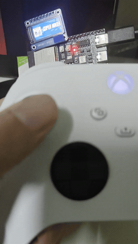

# Introduction

Based on Retro-Go, it integrates the functionality of connecting to the Xbox wireless controller via BLE. It uses an ESP32 S3 N16R8 development board, utilizes a portion of Flash memory as a file partition for game storage, and employs a 0.96-inch screen.

# Preview

# Toolchain

VSCode + ESP-IDF v5.1.6

# Usage

1. Download img, bin([Releases](https://github.com/lakiax/retro-go-esp32s3-xbox/releases/))

2. Flash firmware
   
   `python -m esptool -p COM4 -b 921600 write_flash 0x0 .\retro-go_44f6d-dirty_esp32s3-xbox-096inch.img`

3. Flash game firmware to internal storage
   
   `python -m esptool --port COM4 write_flash 0x6A0000 roms.bin`

# Reference

- [retro-go](https://github.com/ducalex/retro-go)

- [esp32s3_xbox_adapter](https://github.com/jocover/esp32s3_xbox_adapter)

# License

Everything in this project is licensed under the [GPLv2 license](COPYING) with the exception of the following components:

- fmsx/components/fmsx (MSX Emulator, custom non-commercial license)
- handy-go/components/handy (Lynx emulator, zlib)
